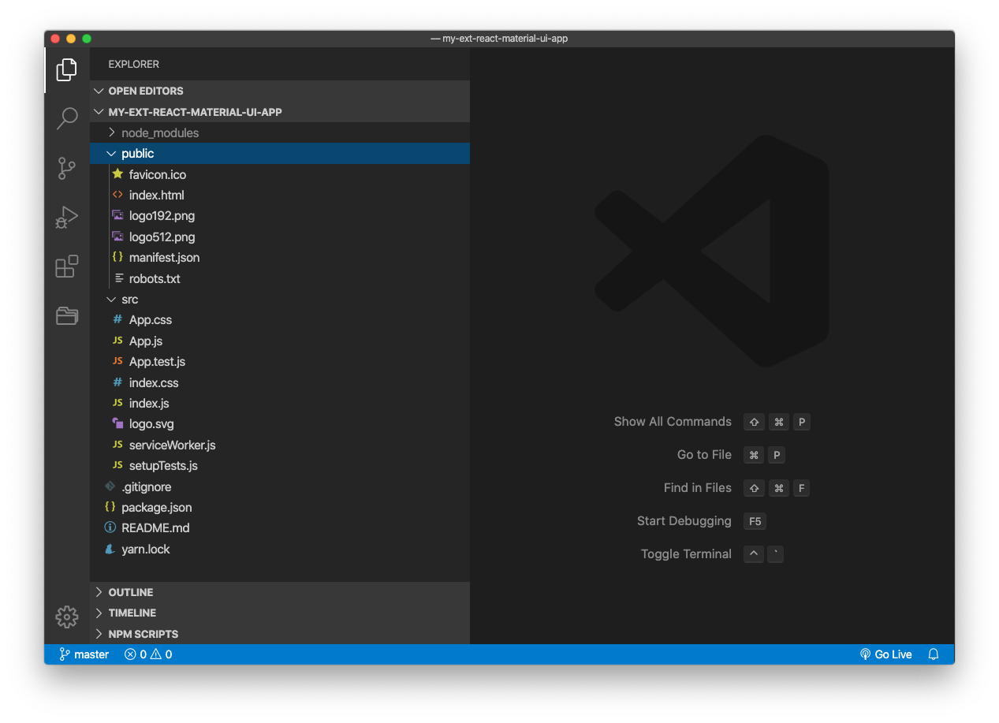
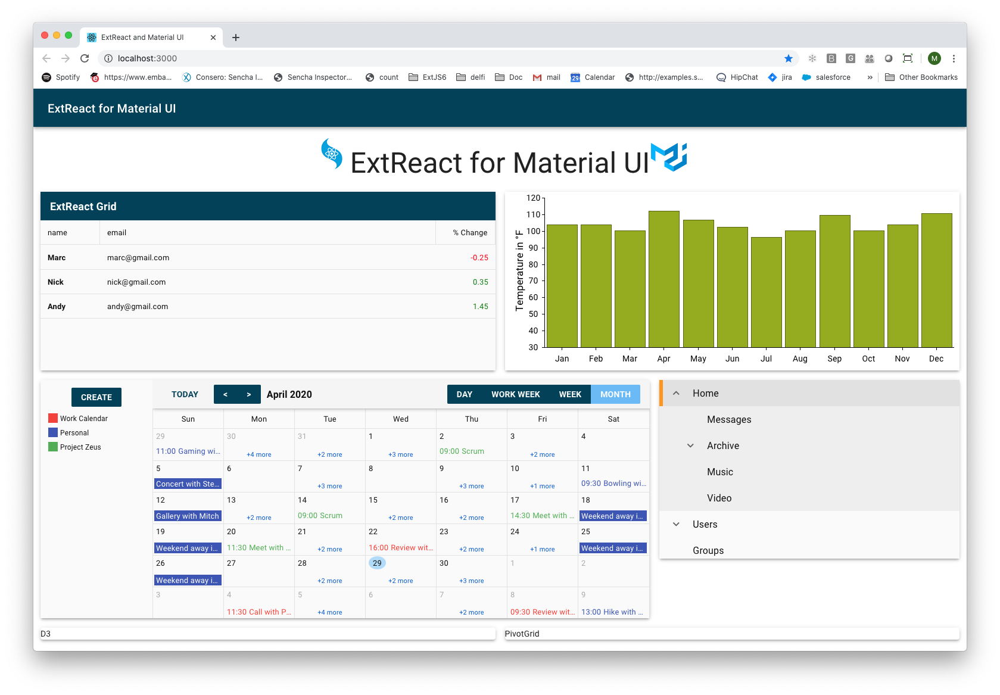

# Getting Started with ExtReact for Material-UI

## Requirements
Fetch your npm credentials and generate an application.

### Step 1: Retrieve npm Repo Access Credentials
To gain access to the Sencha npm repository:

Currently ExtReact for Material-UI is delivered to customers through the general ExtReact product.

1. [Start a free trial of ExtReact for Material-I (which is in the ExtReact product)](https://sencha.com/products/extreact/extreact-for-material-ui/evaluate/).
2. [Purchase ExtReact for Material UI (which is in the ExtReact product)](https://www.sencha.com/store/extreact/).

#### Login to the npm repository
Once you have your credentials login to the npm repo.

production:

```sh
npm login --registry=https://npm.sencha.com/ --scope=@sencha
```

### Step 2: Create a React starter app

To get started with ExtReact for Material-UI, first create a starter application with create-react-app.

More details on create-react-app are [available here](https://reactjs.org/docs/create-a-new-react-app.html#create-react-app)

Open up terminal (mac) or command (window) and navigate to the folder where you want to create your application.

Run the following:

```
npx create-react-app my-ext-react-material-ui-app
```

The application generation will take a few minutes and will generate in a folder called 'my-ext-react-material-ui-app'

Change your directory to the created app folder:

```
cd my-ext-react-material-ui-app
```

for the generic starter option, run the following:

```
npm start
```

The following will appear in a browser window:


### Step 3: Open your Editor or IDE to Add ExtReact for Material-UI

To add ExtReact for Material-UI to this starter application, open your text editor or IDE in the 'my-ext-react-material-ui-app' folder.

If you use Visual Studio Code, stop the running application (ctrl+C) in the terminal or command window and run:

```
code .
```

The image shows Visual Studio code with the root folder and expanded 'public' and 'src' folders.

We will make changes to these folders to enable ExtReact for Material UI.



### Step 4: Add the ExtReact and Material-UI npm packages, and starter code

Open package.json in the root of the app, and add the following to the dependencies section:

```
    "@material-ui/core": "~4.9.10",
    "@material-ui/icons": "~4.9.1",
    "@sencha/ext-react-material-ui": "^7.2.1",
    "@sencha/ext-react-material-ui-engine": "^7.2.1",
    "@sencha/ext-react-material-ui-theme": "^7.2.1",
```

Then, in the command window, run the following:

```
npm install
```

Next, create a file named src/theme.js and add the following code:

```
import { red } from '@material-ui/core/colors';
import { createMuiTheme } from '@material-ui/core/styles';
const theme = createMuiTheme({
  palette: {
    primary: {
      main: '#024059',
    },
    secondary: {
      main: '#19857b',
    },
    error: {
      main: red.A400,
    },
    background: {
      default: '#fff',
    },
  },
});
export default theme;
```

Edit the existing src/index.js and update it with the following code:

```
import '@sencha/ext-react-material-ui-engine';
import '@sencha/ext-react-material-ui-theme';
import CssBaseline from '@material-ui/core/CssBaseline';
import { ThemeProvider } from '@material-ui/core/styles';
import theme from './theme';
import ExtReactDOM from '@sencha/ext-react-material-ui';

import React from 'react';
import ReactDOM from 'react-dom';
import './index.css';
import App from './App';
import * as serviceWorker from './serviceWorker';

ExtReactDOM.render(
  <React.StrictMode>
    <ThemeProvider theme={theme}>
      <CssBaseline />
      <App />
    </ThemeProvider>
  </React.StrictMode>,
  document.getElementById('root')
);
var baseColor = theme.palette.primary.main;
document.documentElement.style.setProperty("--base-color", baseColor);
serviceWorker.unregister();
```

Edit the existing src/App.js and update it with the following code:

```
import React, { Component } from 'react';
import AppBar from '@material-ui/core/AppBar';
import Toolbar from '@material-ui/core/Toolbar';
import Typography from '@material-ui/core/Typography';
import Container from '@material-ui/core/Container';
import { ExtGrid } from "@sencha/ext-react-material-ui";

export default class App extends Component {
  render() {
    return (
      <div style={{marginTop:'77px',marginLeft:'12px'}}>
        <AppBar position="fixed">
          <Toolbar>
            <Typography variant="h6" noWrap>
              ExtReact and Material UI Components in the same Application
            </Typography>
          </Toolbar>
        </AppBar>

        <Container>
            <Typography component="h1" variant="h3" align="center" color="textPrimary" gutterBottom>
            
            
              ExtReact and Material UI
            </Typography>
        </Container>

        <ExtGrid
          width="400px"
          height="400px"
          title="The Grid"
          store={
            {
              xtype: 'store',
              data: [
                { name: 'Marc', email: 'marc@gmail.com',priceChangePct: .25 },
                { name: 'Nick', email: 'nick@gmail.com',priceChangePct: .35 },
                { name: 'Andy', email: 'andy@gmail.com',priceChangePct: 1.45 }
              ]
            }
          }
          columns={[
            {text: "name", dataIndex: "name"},
            {text: "email", dataIndex: "email", flex: "1"},
            {
              text: "% Change",
              dataIndex: "priceChangePct",
              align: "right",
              producesHTML: false,
              renderer: this.renderSign
            }
          ]}
        >
        </ExtGrid>
      </div>
    )
  }
}
```

### Step 5: Run the ExtReact for Material-UI app

To see the application running in a browser, thpe the following in the terminal/command window:

```
npm start
```

A browser window will load, and you will see the application:

